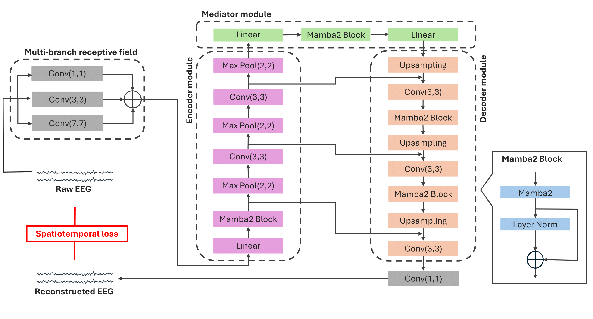

# EEGM2: An Efficient Mamba-2-Based Self-Supervised Framework for Long-Sequence EEG Modeling

**Authors:** 
[**Jiazhen Hong**](www.linkedin.com/in/jiazhen-hong66),
[Geoffrey Mackellar](https://www.linkedin.com/in/geoffmackellar/?originalSubdomain=au), 
[Soheila Ghane](https://www.linkedin.com/in/soheila-ghane/?originalSubdomain=au)

This work follows from the project with [**Emotiv Research**](https://www.emotiv.com/pages/enterprise), a bioinformatics research company based in Australia, and [**Emotiv**](https://www.emotiv.com/), a global technology company specializing in the development and manufacturing of wearable EEG products.

**EEGM2 Paper:** <a href="https://arxiv.org/abs/2502.17873" style="text-decoration: none;">arXiv</a>, 


## Overview
**EEGM2** EEGM2 is a self-supervised framework designed to leverage **Mamba-2 blocks** to accurately model sequences of various lengths in EEG signals while minimizing computational complexity for resource-limited environments.

## Key Features  
1. A **reconstruction-based framework** that captures both local and global EEG features through Mamba-2 structured state space models.  
2. A **spatiotemporal-aware loss function** that enhances robustness to noise and preserves spectral information.  
3. A **multi-branch receptive field input embedding strategy** that improves cross-subject generalization and stability for EEG sequences of varying lengths.  
 


## **Setup**  
### Instructions refer to Unix-based systems (e.g., Linux, macOS).  

This code has been tested with **Python 3.10.16**. For users who prefer using Conda, environment YAML files are provided.

#### **Create an environment from a specific file:**  
```bash
conda env create -f Env-requirement/JHMamba2-env20250206.yml
```

#### Note:
1. Mamba block used in this project was downloaded by JH on **11/14/2024** from [Mamba GitHub](https://github.com/state-spaces/mamba), only numpy < 2.x is accepted.  
2. Mamba-2 block used in this project was downloaded by JH on **12/14/2024** from [Mamba2 GitHub](https://github.com/state-spaces/mamba/blob/main/mamba_ssm/modules/mamba2.py).


## Repository Structure  
```plaintext
EEGMamba/
├── Code/                # Main directory for self-supervised learning and downstream tasks
│   ├── models/          # Includes EEGM2 and its variants
│   └── utility/         # Related functions        
├── Datasets/            # Source of raw EEG data and Pre-processing.py
├── Figures/             # Diagrams and visual representations
├── Pretrained_EEGM2/    # Pretrained models and checkpoints
│   ├── DrivierDistraction/          # model trained on EMOTIV dataset
│   └── TUAB/            # model trained on EMOTIV dataset with varying duration
├── Env-requirement/     # Environment backups with dates
└── README.md            # Project overview and documentation
```

